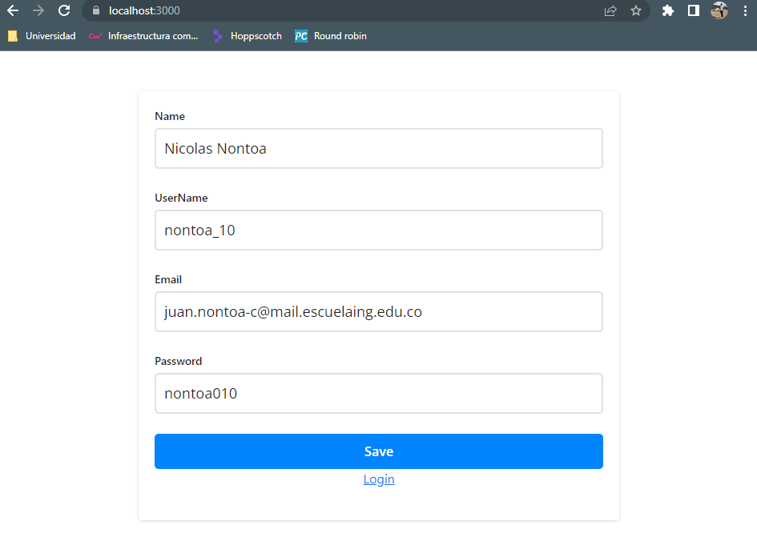
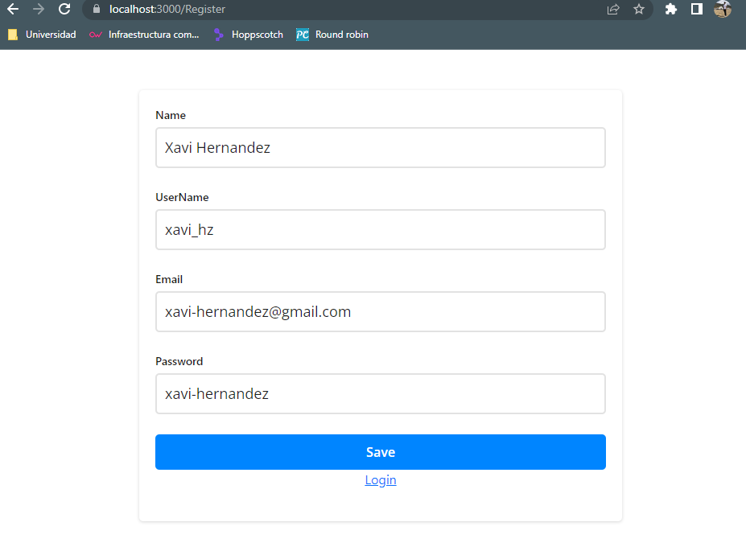
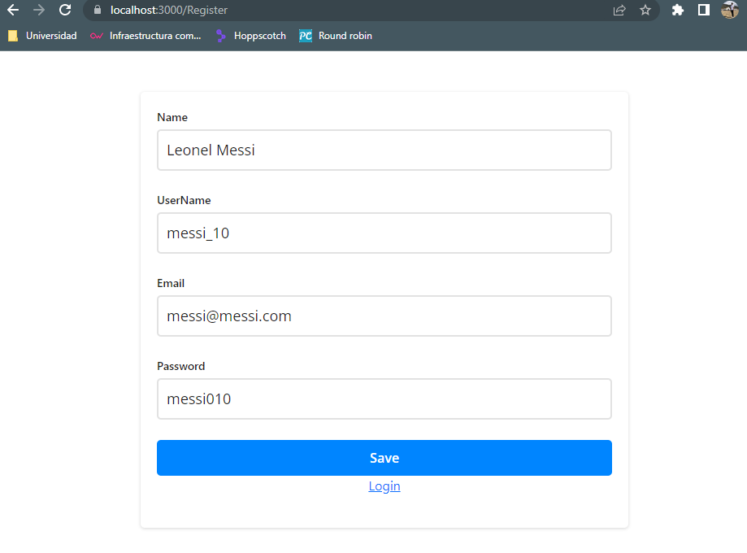
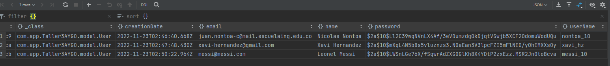
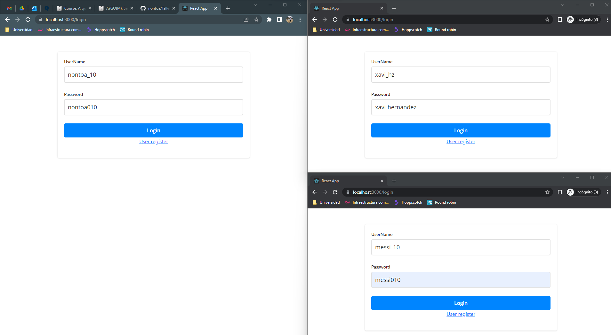
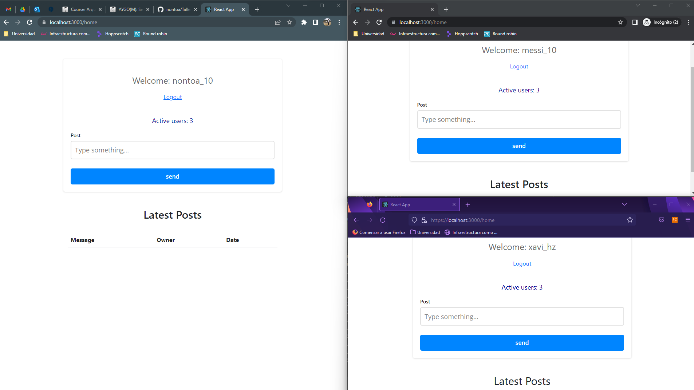
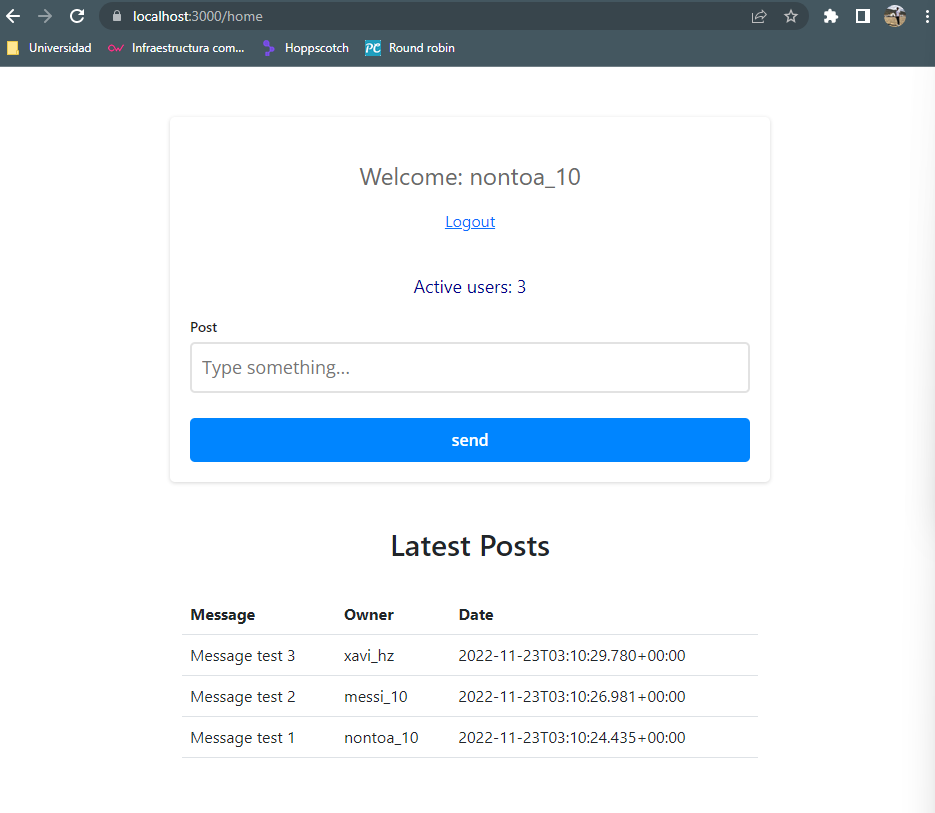
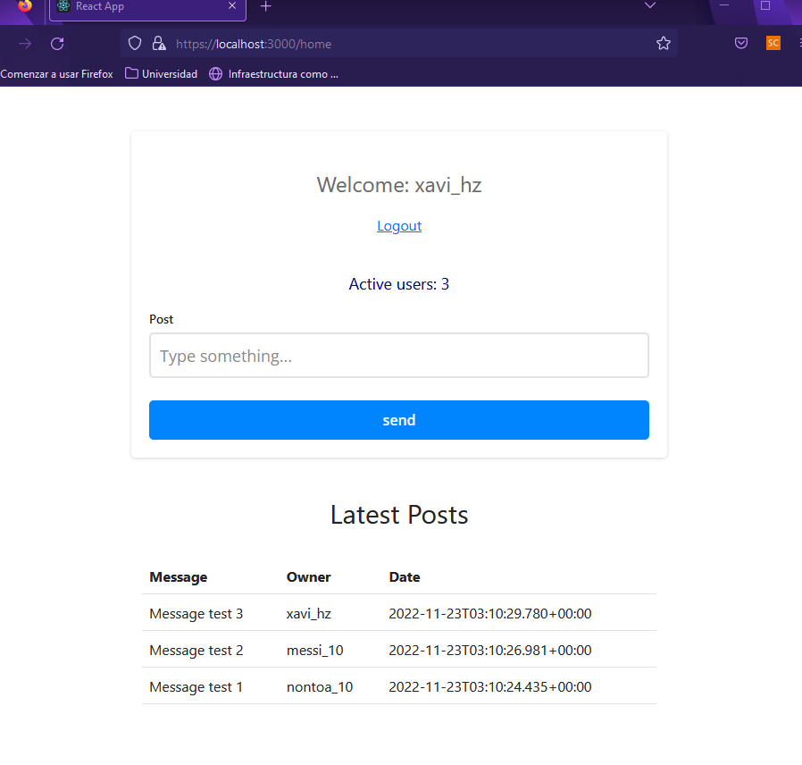
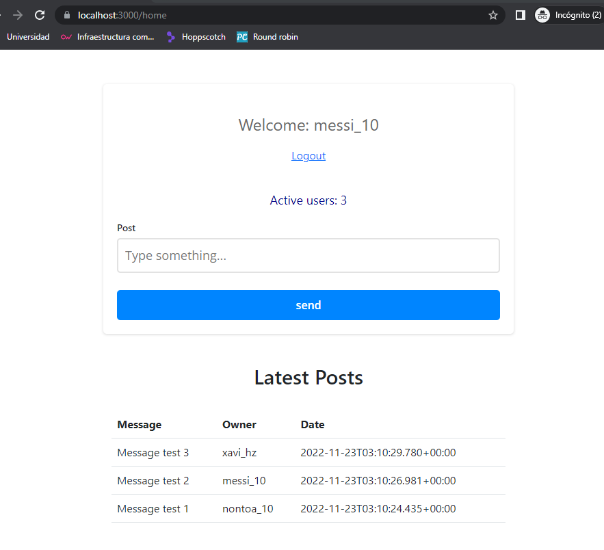
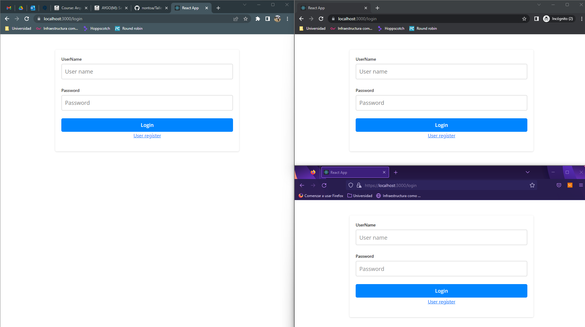

# Taller3-AYGO

In the laboratory was implemented a simple web application with the following features:

- Is a secure application, running over HTTPS.
- Allow users to authenticate using a password.
- The application grants integrity and authorization.
- The application allows to create users, login, post and see messages in order of creation, see current users logged-in and all in real-time.

## Context diagram

## Description

The simple web application is made in react js, where the user can create users, login with the respective created user, create posts, see the latest posts in real time and the current active users. The web application is running over HTTPS. The app-service (backend) managed the users authentication and authorization using spring security. All data is persisted in a mongo data base.

## Example doing the exercise

First let's create 3 different users (this operation does't need authentication because at the begining we don't have any user)

We can see that the users are already created in the data base

Then we can proceed to login with the users created previously (in this step the web-app-service (frontend) is gonna authenticate the users and the app-service (backend) are gonna return a JWT that is gonna be active for 10 minutes)

Now we can post any message and the other users can see the message, creation date and the message's owner

Finally we can logout

## Technology Stack

- 
- 
- 
- 
- 
- 